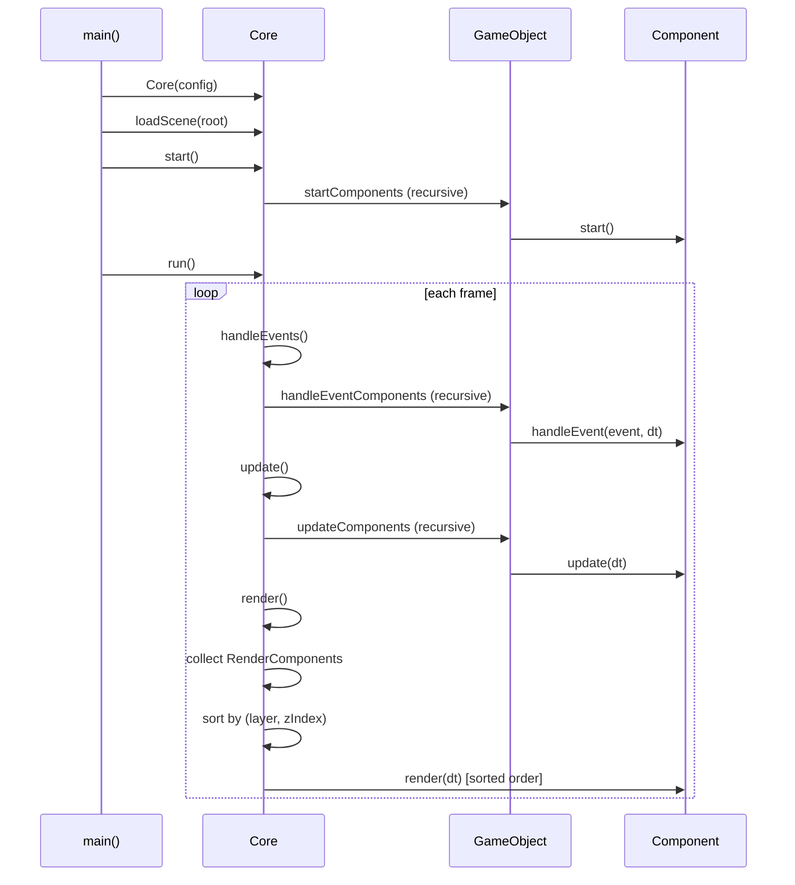
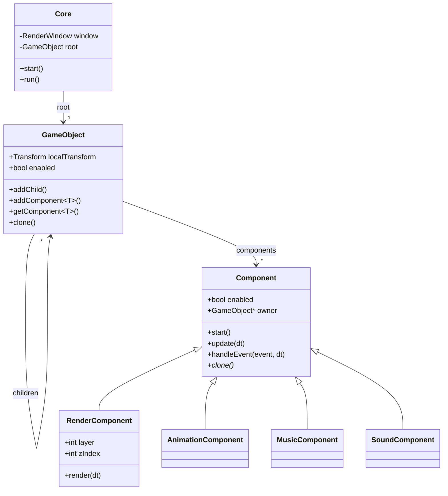

# Architecture Overview

A game starts by constructing a Core with a window config, then loading a GameObject tree as the scene.
`Core::start()` calls `Component::start()` on every component in the tree.
`Core::run()` enters the loop: handle events, update, render — all dispatched recursively through the scene graph.
Each step calls the corresponding virtual method on every component, as shown in the following diagram.

 All engine types can be found in `include/engine/`. See [Core.h](../include/engine/Core.h) for the game loop API.

The next diagram shows the structural relationship between the core, game objects and their components.

